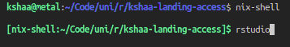
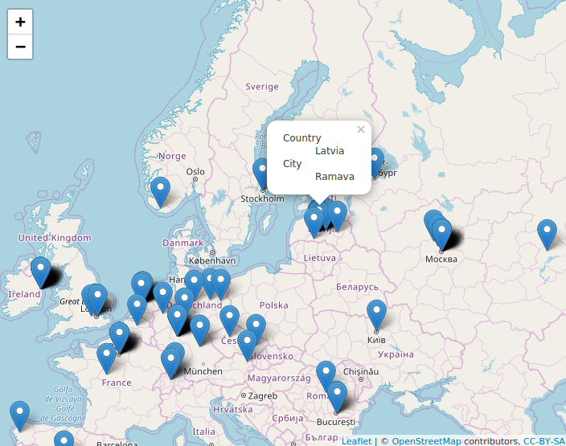

# Kshaa Landing Access
An R project to plot all the IPs, which have accessed my site on a map.  

## Research environment
```
nix-shell
```

## Data configuration
Because of GDPR, I won't publish actual IPs from my access log, but feel free
to create your own plottable IP list by creating `/data/ips.txt` from `/data/ips.txt.sample`

To geolocate IP addresses I use MaxMind's GeoLite2 database, it takes up a lot of space therefore isn't in this repository.  
Download it in [MaxMind's GeoLite2 site](https://dev.maxmind.com/geoip/geoip2/geolite2/) and put it in `/data/geodb.mmdb`.  

## Run REPL (r)
```
R

* execute source("main.R") *
```

## Run IDE (rstudio)
```
rstudio 

* Select "main.R" file *
```

## Result
Enter environment   
 

Render access map  


## Notes
- Nix & R inspiration - [Mozilla "A truly reproducible research paper"](https://mozillafoundation.github.io/2017-fellows-sf/re-papers/)   
- Nix & R usage information - [NixOS Wiki "R"](https://nixos.wiki/wiki/R#With_nix-shell)  
- Information about map plots with R - ["RStudio - Leaflet"](https://rstudio.github.io/leaflet/)  